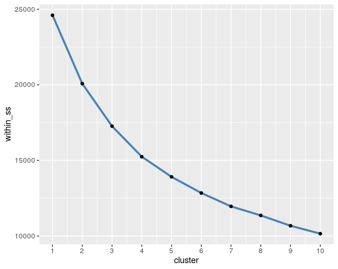
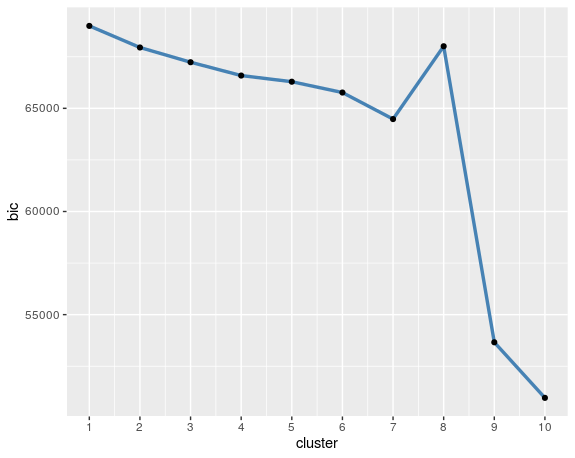

# Customer Segmentation

**KEYWORDS**<br/> 
Clustering, customer segmentation, persona, customer profiling 

**PROBLEM**<br/>
Segment customers into different groups and create customer pofile<br/>

**TECHNIQUES**<br/>
Data cleansing and visualization: dplyr, tidyr, ggplot2 <br/>
Clustering: psych, cluster, mclust

**DATASETS**<br/>
Audience Listening Respond: survey data that contains 48881 observations and 217 variables about customer demographic, income, fashion attitude, and lifestyle etc. Raw data is in binary format.  

**VARIABLES SELECTED**<br/>
Willingness to engage in online shopping, brand loyalty, price sensiticity, seasonal shopping behavior, importance of product look vs brand
#
**Type of clustering**
- hierarchical 
- k means 
- model based 
#
**Hierarchical Clustering With Two Clusters**
```
h_segments = cutree(tree = clusters, k = 2)
temp = data.frame(cluster = factor(h_segments),
                  factor1 = fa(reduced,nfactors = 3,rotate = "varimax")$scores[,1],
                  factor2 = fa(reduced,nfactors = 3,rotate = 'varimax')$scores[,2])
ggplot(temp, aes(x=factor1, y = factor2, col = cluster))+geom_point()

clusplot(reduced,
         h_segments,
         color = T,shade= T,labels = 4, lines = 0, main = "Hierarchical Cluster Plot")

```
<br/>

<p align="center">
    &nbsp;   &nbsp;   &nbsp;   &nbsp;   
   
</p>

# 
**Kmeans Clustering**
```
set.seed(617)
km = kmeans(x = reduced,centers = 3,iter.max = 10000, nstart = 25)
table(km$cluster)
within_ss = sapply(1:10,FUN = function(x) kmeans(x = reduced,centers = x,iter.max = 1000,nstart = 25)$tot.withinss)

```
###### Use Silhouette Plot to determine the number of clusters



###### A cluster of 3 or 4 seems to be the optimal. Let's further calculate the silhouette width given these two number of clusters

```
pam(reduced,k = 3)$silinfo$avg.width
#0.14
pam(reduced,k = 4)$silinfo$avg.width
#0.16
```
###### we choose 3 clusters 

<p align="center">
   &nbsp;   &nbsp;   &nbsp;   &nbsp;   
   
</p>


#
**Model-based Clustering**

```
clusters_mclust = Mclust(reduced)
clusters_mclust_3 = Mclust(reduced,G=3)
mclust_bic = -sapply(1:10,FUN = function(x) Mclust(reduced,G=x)$bic)
ggplot(data=data.frame(cluster = 1:10,bic = mclust_bic),aes(x=cluster,y=bic))+
    geom_line(col='steelblue',size=1.2)+
    geom_point()+
  scale_x_continuous(breaks=seq(1,10,1))
  
```
<br/>


###### we need to find the nunber of cluster with low bic, cluster of 10 is low, but is not practical. Considering the result of other clustering method, so we choose 3 clusters

<p align="center">
   &nbsp;   &nbsp;   &nbsp;   &nbsp; 
   
</p>

